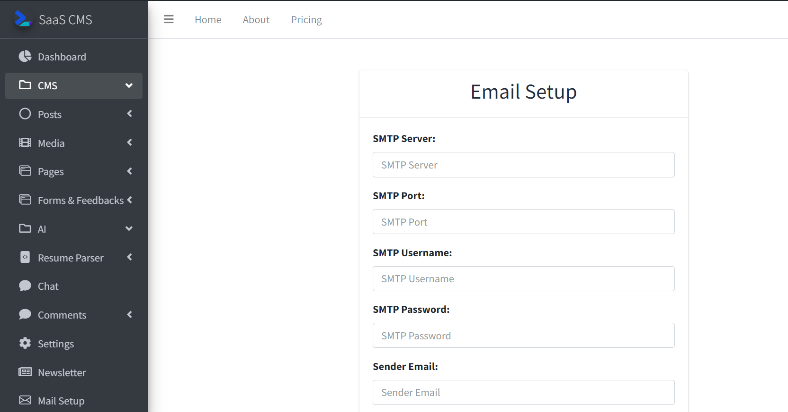

#Email Setup
> [!NOTE]\
> Without this the subscribers won't receive updates about posts.

Users have to setup there email in order to be able to send [newsletters](newsletter.md) to the subscribers and to recieve feedbacks from admin. 

