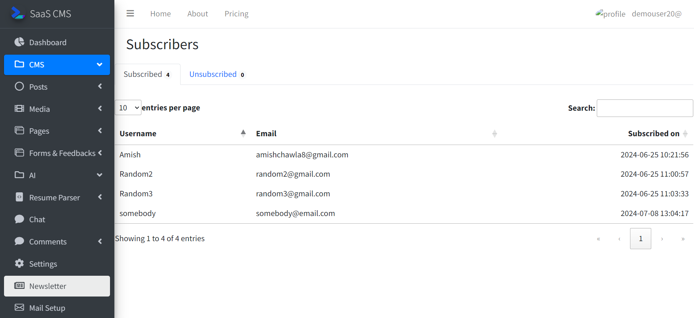
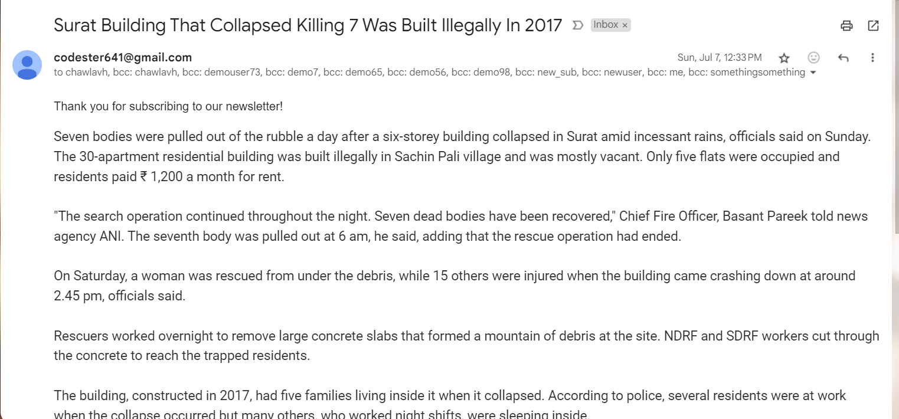

#Newsletters

Users can send newsletters to the subscribers 
Subscribers would be auto updated whenever the user drops a new post.

Users can see the subscribers growth in realtime

Subscribers receive email describing your post in detail like this.

