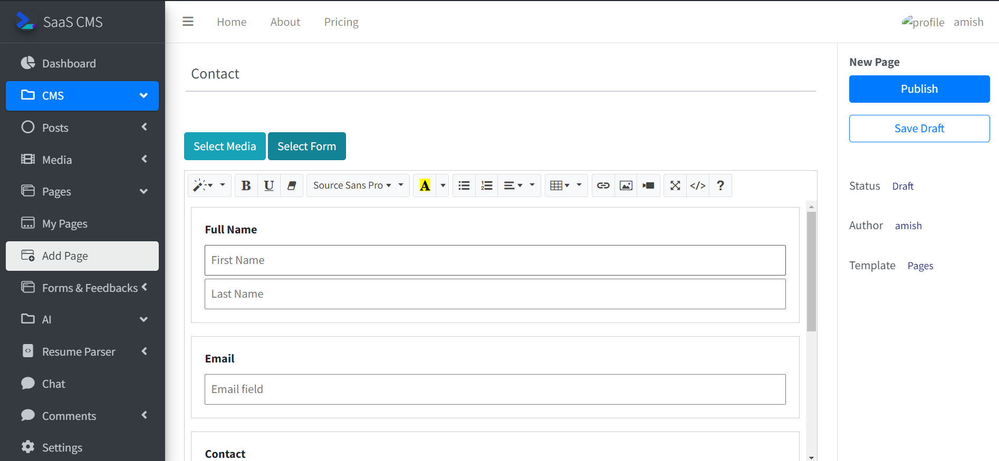
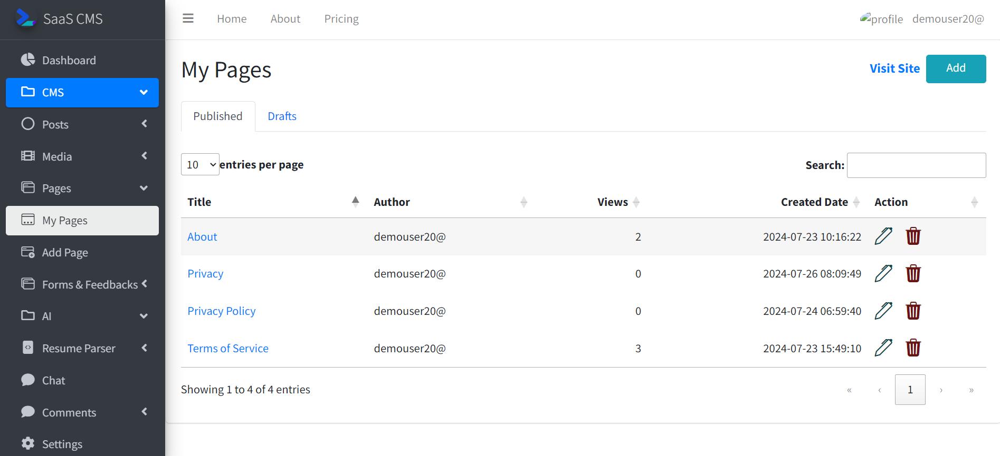
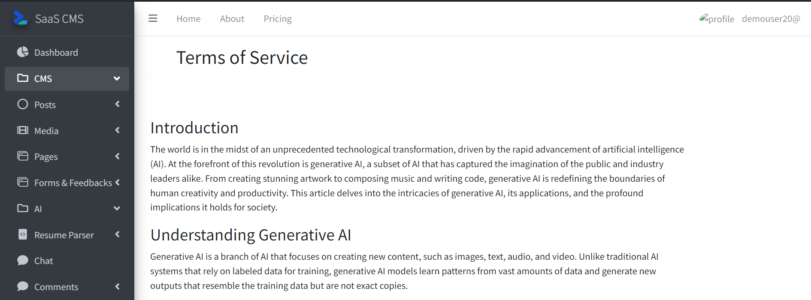

#Pages

Pages are webpages that users of the application can create dynamically to spread there content

###_1. Add Page_

User can add pages without coding into their website.

While creating page user can add media from [media library](media_lib.md) or a form created by [formbuilder](formbuilder.md) like contact us etc.

###_2. List of Pages_
User can see the pages that they have created edit and modify them in one place.

###_3. View Page_
After creating page it will look like this.

You can add media such as images or videos into pages and you can also add forms that are dynamically generated to collect information from people such as polls contact form etc.
