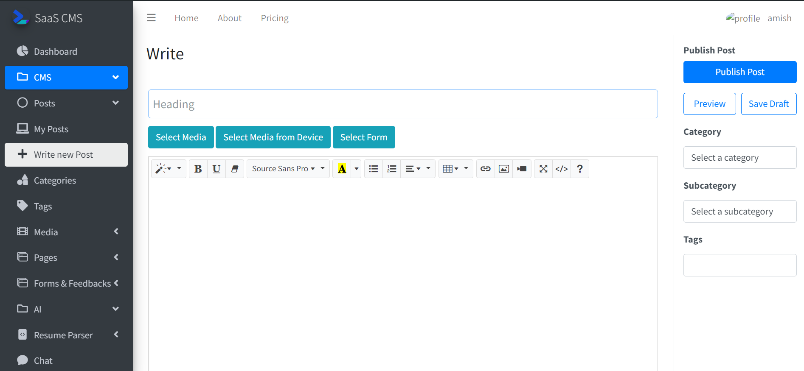
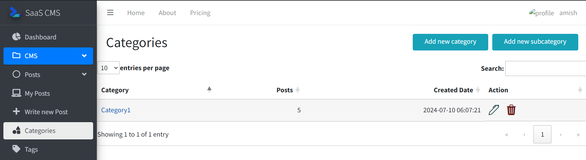
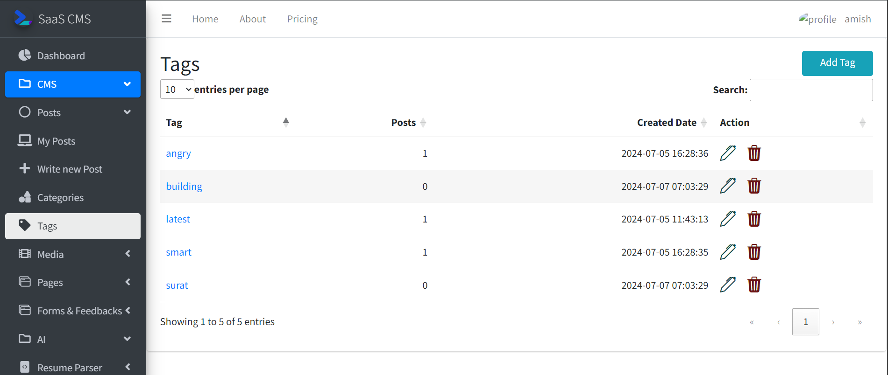
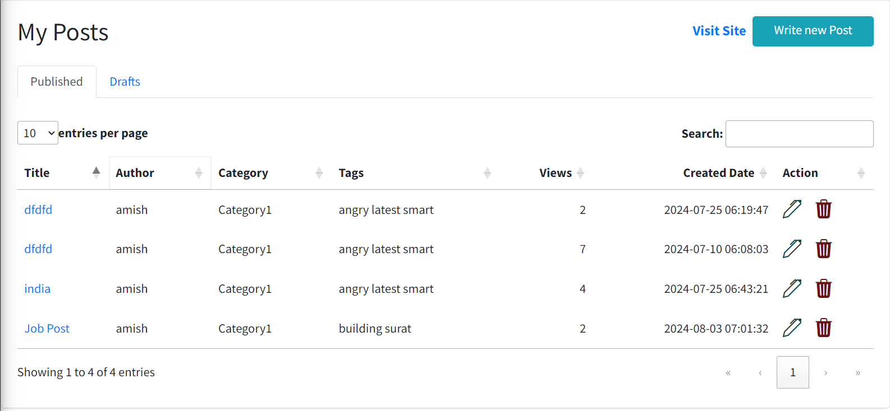
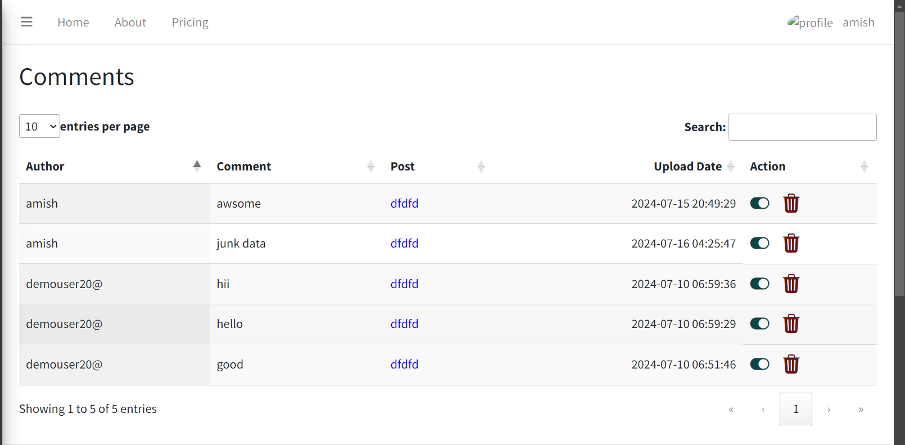
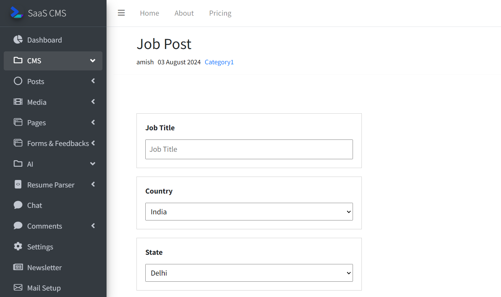

#Posts

Posts are articles or jobpost or property post anything that the user wants to show.
Users can include [media](media_lib.md) or [forms](formbuilder.md) depending upon the usecase of the user

###_1. Create Post_

Posts are further divided into categories subcategories and tags for easier understanding.

###Categories and Subcategories
These help user organise their posts for example while posting a job 
User can set _Category as Software Developer_ and _Subcategory as Data Scientist_
This will help them understand what this post is about.

###Tags
Giving tags to the posts help the users to search the post easily on their website as well as they can track what is trending and write posts accordingly.

###_2. List of Posts_
My posts page of user panel shows all posts that user has created. User can Modify or Delete post from this page.
Users can track their posts views, comments etc.

User can approve or Disapprove and control what comments will be visible on the post
###_3. View Post_
This is how a post with a job post form looks when clicked

Users can preview and save posts to publish later. Published posts are visible on [user site](user_site.md)
