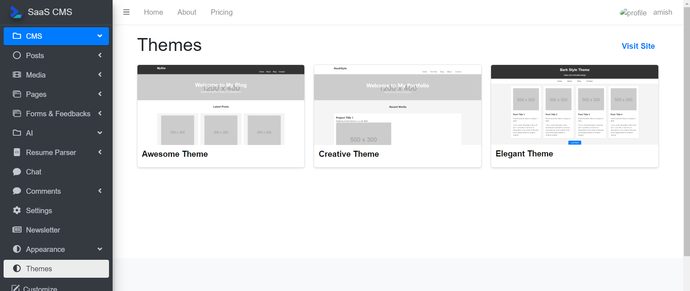
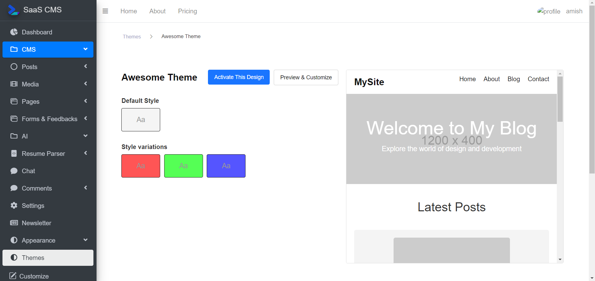
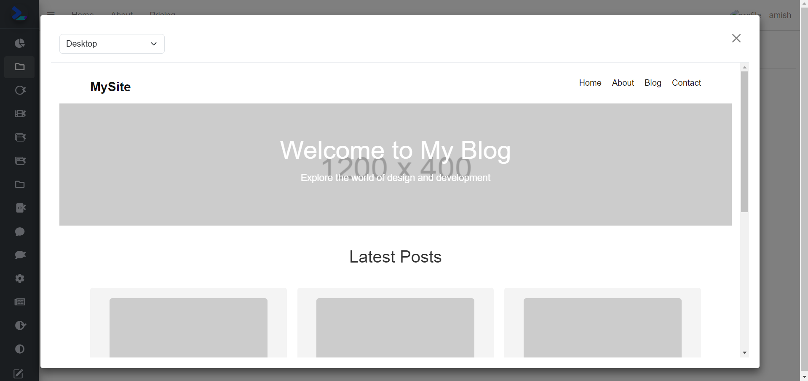
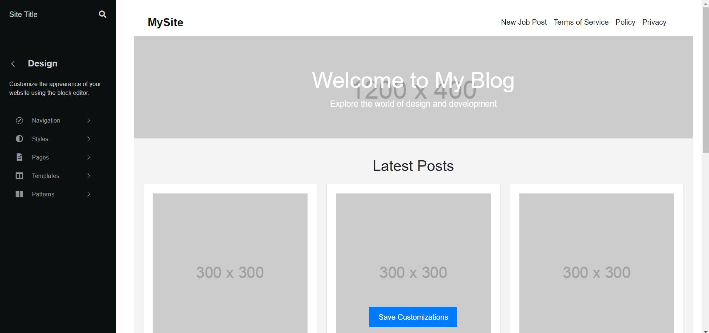
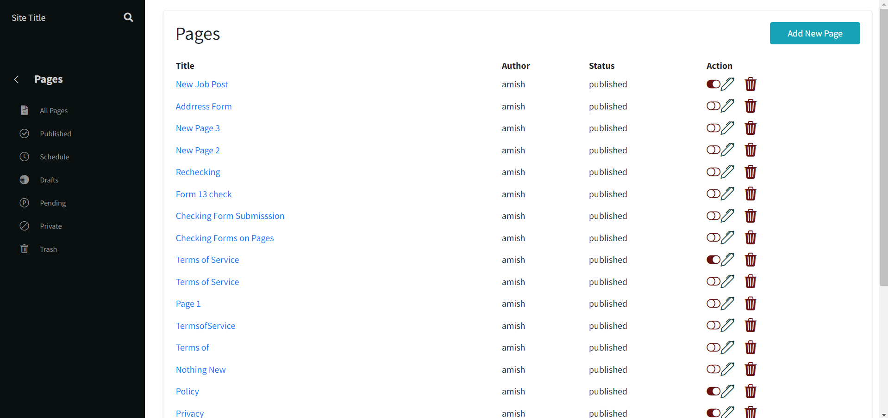

# Themes

The SaaS CMS allows users to manage and customize website themes. This documentation explains how to manage themes, activate them and customize their appearance.

## Table of Contents

1. Theme Overview
2. Activating a Theme
3. Customizing Themes
4. Theme API Endpoints

### _1. Theme Overview_
Themes control the visual layout and design of your website. Each theme consists of HTML templates, stylesheets, and other assets that define the appearance of your site.

Users can:

* View available themes.
* Activate a theme.
* Customize a theme.

### _2. Activating a Theme_
**Step-by-Step Guide:**
* Navigate to the Themes section of the dashboard (/user/appearance/themes).
* Browse available themes.
* Select a theme.
* Click the **Active This Design** button on the desired theme.
* The theme will now be active across your site.

**Preview Theme**

**API Endpoint:**
* Method: POST
* Endpoint: /user-active-theme

### _3. Customizing Themes_
**Available Customizations:**

**User can customize your theme’s visual elements directly in the theme settings:**

* **Logo Text:** Modify the site's logo text.
* **Hero Title:** Change the main headline.
* **Hero Subtitle:** Edit the subtitle under the hero section.
* **Hero Background:** Update the background image of the hero section.
* **Footer:** Edit footer.
* **Add Links:** Add links.

**How to Customize a Theme:**

* Go to the Themes section (/user/appearance/themes).
* Click on the Customize button for a selected theme.
* Edit the fields such as logo text, hero title, hero subtitle.
* Save Customizations to apply them.
* Select the pages that will appear on the site.

* API Endpoint:
* Method: POST
* Endpoint: /user/appearance/theme-customization

### _4. Theme API Endpoints_

**Get All Themes**
* Method: GET
* Endpoint: /user/appearance/themes

**Activate Theme**
* Method: POST
* Endpoint: /user-active-theme

**Customize Theme**
* Method: POST
* Endpoint: /user/appearance/theme-customization

This documentation provides a clear and structured overview of how to manage themes in your CMS. You can extend or modify it as needed.

