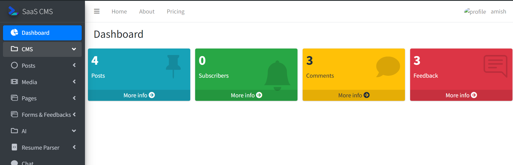

#User Panel
User Panel is the panel that the users of the application will be able to access to create their content.

###User Dashboard
Dashboard is the one page representation of user stats such as posts, Comments, Subscribers, Feedbacks etc.

###Features of User Panel
[1.Create and manage Posts](posts.md) \
[2.Create and manage Pages](pages.md)  \
[3.Use newsletters to notify audience](newsletter.md) \
[4.Build custom forms and deploy them to posts and pages using formbuilder](formbuilder.md) \
[5.Store media in Media library to use them repeatedly](media_lib.md)